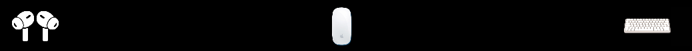

# BT devices - Pock Widget
See your connected bluetooth devices right on your TouchBar with this Pock Widget.



> [!NOTE]
> I have never worked with swift before. This is my first (and *probably* last) swift project.
>
> With very few Pock extension to take inspiration from and the PockKit documentation not completed, I hope you'll forgive me for the super bad code (it's mostly copy and paste from other Pock extensions). My low knowledge on swift and MacOS development led me to work on this project only in my free time, but after few weeks of development, I encountered some obstacles I knew would take me too long to overcome.
>
>Therefore, if you want to contribute to this project, you are more than welcome to do so, but more on that in the contributions section.

## Next up:
I have some ideas I'd like to implement in this widget:

* More devices supported
    
    The main issue is that I have few devices to connect to my MacBook, so few devices to scan and insert manually in the code. I've searched in the logs of the connected devices for some keyword that identifies what kind of device is connected, but I've found nothing. If you have more knowledge in the BluetoothIO package or even in Bluetooth in MacOS, your help would be super useful.

* Long press: Disconnect and Forget buttons

    In the Dock Widget, by long pressing an app icon, two buttons show up. Same thing, but with the possibility to disconnect the device or forget it completely. I have not yet searched how to implement this function with PockKit, so this could actually be easy.

* Battery indicator

    A simple method to indicate the battery status of a device. It could be shown when you long press the device. Another, probably more immediate method is the battery indicator in iOS widget, shown as a green/orange/red circle.

* Settings

    In Pock widgets, settings are written in a separate file, ```Preferences.swift```. I don't know how or why, but I was not, for some reason, able to use multiple files without breaking everything up. I've tried for so long, but my limited knowledge on XCode didn't help. Some settings I'd like to add are:
    * Changing icon for earbuds from a certain selection, in order to be more similar to the actual ones used by the user.
    * Max number of elements shown in TouchBar
    * Ignore some devices
    * Show an X when no devices are connected: bool, default should be ```false```
    

## Contributions
I will not change the MIT licence choosed for PockKit, therefore you are free to use, clone, fork and change deliberately this widget based on your personal preference. I know I'm not able to improve this project further with my current knowledge, but if you are willing to help me, it would be very appreciated.


Some things i left in the code to simplify logging and device readings are a ```print(devices)``` and a ```print("\(String(device.addressString))")``` in a for-loop. Also, almost everything about the code main structure is copied from the [Pock Status Widget](https://github.com/pock/status-widget), but it's what you get when you're trying to develop a widget wihtout the proper documentation and knowledge. I've also found [some problems installing some third-party widgets](https://github.com/MXCR-cpu/oil/issues/2), so if you have any problems setting mine up, I'll try to help you with my very limited knowledge.

## Final Thanks
So so many thanks to [Pierluigi Galdi](https://github.com/pigigaldi). Your app is a true revolution in terms of touchbar utilization. It seemed like Apple forgot to develop pretty much anything for it. I think the touchbar had so much potential, and Pock truly shows that.

Out of gratitude, and also because someone may be searching this, I'll drop this little informations here: I've searched Pock extensions to see how much potential this project could open to. Apart from the defaults Pock widgets that you can find in the [Pock's GitHub page](https://github.com/pock), I've found a [piano widget](https://github.com/p-x9/pock-piano-widget) that produce sounds, [Quit-Pock](https://github.com/kylegorter/Quit-Pock), a widget to close the active running application, and [Oil](https://github.com/MXCR-cpu/oil), a widget to see system resources usage. I'm sure someone could find this projects useful and inspiring as I have.
